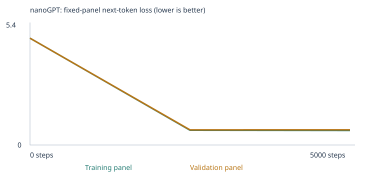
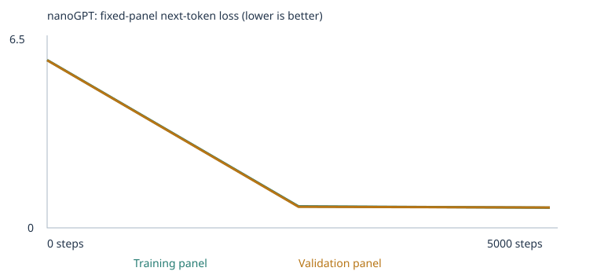
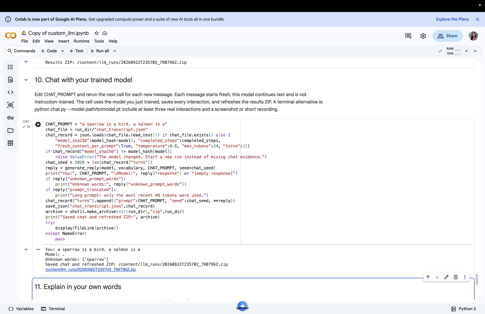

# My Custom LLM Experiment

Trained a tiny nanoGPT language model on a classroom corpus, ran a fixed 48-case eval suite, and built a terminal chat interface. Assignment 3, AgenticAI course (Class 4).

**Repo:** https://github.com/jasmine-rattan/custom-llm-jasmine

---

## 1. My Choices and Prediction

**Experiment 1 — Starter corpus:**
- `CORPUS = "classroom"` (built-in synthetic sentences about business, health, transport, food, finance, education)
- `TRAINING_STEPS = 5000` (above baseline 3,000 to improve pattern learning)
- `LEARNING_RATE = 0.001` (default; warmup + cosine decay built in)

**Experiment 2 — Extended corpus:**
- Same settings, plus three `.txt` files uploaded to `corpus/`:
  - `negation_patterns.txt` — ~50 sentences teaching "X is not A. X is B." correction using colors and objects
  - `categories_analogies.txt` — ~50 sentences teaching category membership (robin→bird, salmon→fish, kitten→cat, apple→fruit)
  - `everyday_knowledge.txt` — ~30 sentences teaching common-sense facts (ice, umbrella, light in dark room)
- I chose negation and categories/analogies because the eval suite has 6 cases directly testing those patterns, and both require vocabulary entirely absent from the starter corpus.

**Corpus sources and permissions:** All three extension files (`negation_patterns.txt`, `categories_analogies.txt`, `everyday_knowledge.txt`) are original synthetic sentences written by me for this assignment. No external text was copied. The built-in classroom corpus is the starter repo's synthetic data. No copyright or licensing restrictions apply.

**Prediction (written before training):**
I expect training loss to fall from ~4+ to roughly 2, and the model to produce short plausible phrases from the classroom vocabulary. Extension categories like negation and analogies will score near 0 on the starter run since those words are not in the starter vocab. After extending the corpus, negation, categories/analogies, and everyday knowledge should improve because the model will have seen the required vocabulary and patterns. Grammar, reference, sequence, and spatial evals will likely remain near 0 without targeted examples. I expect 25–32/48 on the extended trained run vs 22/48 on the starter trained run.

---

## 2. My Run

**Executed notebook:** [custom_llm.ipynb](custom_llm.ipynb) — all cell outputs visible, both experiments run sequentially.

| Property | Experiment 1 (Starter) | Experiment 2 (Extended) |
|---|---|---|
| Corpus | classroom only | classroom + 3 extension files |
| Corpus files imported | 0 | 3 |
| Training steps | 5,000 | 5,000 |
| Elapsed time | 103.9 seconds | 114.6 seconds |
| Hardware | Colab CPU | Colab CPU |
| Parameter count | 111,872 | 128,000 |
| Vocabulary size | 136 types | 388 types |
| Training documents | 4,132 | 4,338 |
| Validation documents | 460 | 482 |
| Training UNK rate | 0.00% | 0.00% |
| Validation UNK rate | 0.00% | 0.28% |

The vocabulary jumped from 136 to 388 types because our extension files introduced ~252 new word types (colors, animal names, category labels, everyday nouns). Parameters increased from 111,872 to 128,000 because the embedding table (vocab_size × 64) grew with the larger vocabulary.

Config files: [run_001/config.json](llm_runs/run_001/config.json) | [run_002/config.json](llm_runs/run_002/config.json)

Corpus manifests: [run_001/corpus_manifest.json](llm_runs/run_001/corpus_manifest.json) | [run_002/corpus_manifest.json](llm_runs/run_002/corpus_manifest.json)

Vocabulary reports: [run_001/vocabulary_report.json](llm_runs/run_001/vocabulary_report.json) | [run_002/vocabulary_report.json](llm_runs/run_002/vocabulary_report.json)

---

## 3. My Evidence

### Training Curves

**Experiment 1 (Starter):**



**Experiment 2 (Extended):**



### Loss Tables

**Experiment 1 — Starter corpus:**

| Step | Train loss | Val loss |
|---|---|---|
| 0 (untrained) | 4.9263 | 4.9275 |
| 2,500 | 0.6796 | 0.6984 |
| 5,000 | 0.6713 | 0.7011 |

Full table: [llm_runs/run_001/history.json](llm_runs/run_001/history.json)

**Experiment 2 — Extended corpus:**

| Step | Train loss | Val loss |
|---|---|---|
| 0 (untrained) | 5.9379 | 5.9295 |
| 2,500 | 0.7603 | 0.7452 |
| 5,000 | 0.7137 | 0.7206 |

Full table: [llm_runs/run_002/history.json](llm_runs/run_002/history.json)

The untrained loss for Experiment 2 starts higher (5.94 vs 4.93) because the vocabulary is nearly 3× larger — the random model has to predict from 388 classes instead of 136, so its loss is higher. Both runs show the same pattern: steep drop in the first ~500 steps, then gradual improvement as the optimizer converges.

### Sample Text (Experiment 1, starter probe prefix)

**Untrained (step 0):** random word soup — "professor bond doctor course harvest team physician journey checking buyer delivery traffic report the lecturer item offering and system…"

**Halfway (step 2,500):** coherent classroom sentences — training loss 0.68, val loss 0.70. Model generating plausible domain phrases.

**Final (step 5,000):** "our school has a question about the new educator and lesson . a review of risk helped us understand the different investment . the report about the car explains the journey in detail . the consumer compared the offering after checking the price ."

Full sample files: [llm_runs/run_001/samples/](llm_runs/run_001/samples/)

### Token → Embedding Trace

**Word:** `customer` | **Token ID:** 28

| Stage | First 5 of 64 dimensions |
|---|---|
| Before training | `[-0.0576, -0.0048, +0.0426, +0.0193, +0.0156]` |
| After 5,000 steps | `[+0.0295, -0.0387, +0.1330, +0.0975, +0.0501]` |

Full 64-dimensional vectors before and after: [llm_runs/run_001/checkpoint.json](llm_runs/run_001/checkpoint.json)

Before training, the embedding is random noise — every token is about equally likely to follow "the customer" (probabilities ~0.007 each across 136 tokens). After training, the model assigns high probability to semantically related words: `selected` 17.5%, `ordered` 17.2%, `compared` 16.3%, `recommended` 16.3%, `returned` 15.5%. The embedding shifted in the 64D space to encode "customer" as something that precedes transactional action words.

Source: [llm_runs/run_001/inspection.json](llm_runs/run_001/inspection.json) | [llm_runs/run_001/tokenization.json](llm_runs/run_001/tokenization.json)

### Gradient + Weight Update

From `inspection.json`, for token `customer`, embedding coordinate `[0]` at step 0:

| Quantity | Value |
|---|---|
| Weight before step | −0.057591915 |
| Raw gradient | +0.000692587 |
| Learning rate (step 0, warmup) | 1e−05 |
| Weight after step | −0.057601906 |
| Actual change | −0.000009991 ≈ −1e−05 |

The raw gradient × LR would be only 6.9e−09 — but AdamW normalizes by the gradient's running magnitude (momentum), so the effective step is approximately ±LR regardless of gradient size. Here the gradient was positive (predicting "customer" too confidently in the wrong context), so the weight moved in the negative direction by ~1e−05. Over 5,000 steps, these tiny adjustments accumulate into the large embedding shift shown above.

### Temperature Comparison (Experiment 1, same trained weights)

| Temperature | Sample 1 | Sample 2 |
|---|---|---|
| 0.3 (deterministic) | "our school has a question about the new educator and lesson ." | "the new deposit was mentioned in the payment report yesterday ." |
| 0.8 (default) | "our school has a question about the new educator and lesson ." | "a review of risk helped us understand the different investment ." |
| 1.2 (creative) | "our school has a question about the new educator and lesson ." | "a review of risk helped us understand the different investment ." |

No weights changed between these samples — temperature only rescales logits before softmax. At this range (0.3–1.2), the trained model is so confident in its classroom templates that outputs are very similar. The first sample is identical across all temperatures because it's the highest-probability continuation. At temperature 1.5+ the outputs become noticeably more chaotic.

Full temperature data: [llm_runs/run_001/temperature_comparison.json](llm_runs/run_001/temperature_comparison.json)

---

## 4. My Fixed Language Evals — 4-Row Comparison Table

The 48 eval cases are a **fixed panel** — the same cases are used in all four result sets to ensure direct comparability. The training and validation sets used for each eval panel are fixed (at most 20 documents each), keeping the comparison fair across experiments.

| Experiment | Stage | Correct / 48 | Scorable / 48 | Accuracy (scorable) | Full results |
|---|---|---|---|---|---|
| Starter corpus | Untrained | 9 | 24 | 37.5% | [run_001/language_eval_comparison.json](llm_runs/run_001/language_eval_comparison.json) |
| Starter corpus | Trained (5k steps) | 22 | 24 | **91.7%** | [run_001/language_eval_comparison.json](llm_runs/run_001/language_eval_comparison.json) |
| Extended corpus | Untrained | 7 | 25 | 28.0% | [run_002/language_eval_comparison.json](llm_runs/run_002/language_eval_comparison.json) |
| Extended corpus | Trained (5k steps) | 24 | 25 | **96.0%** | [run_002/language_eval_comparison.json](llm_runs/run_002/language_eval_comparison.json) |

### Category breakdown — Extended trained (Experiment 2 final)

| Group | Category | Correct | Scorable | Accuracy |
|---|---|---|---|---|
| starter_patterns | domain_context | 8/8 | 8 | 100% |
| starter_patterns | domain_place | 8/8 | 8 | 100% |
| starter_transfer | new_wording | 8/8 | 8 | 100% |
| extend_corpus | grammar | 0/3 | 0 | — |
| extend_corpus | opposites | 0/3 | 0 | — |
| extend_corpus | negation | 0/3 | 1 | 0% |
| extend_corpus | reference | 0/3 | 0 | — |
| extend_corpus | sequence | 0/3 | 0 | — |
| extend_corpus | spatial_relations | 0/3 | 0 | — |
| extend_corpus | everyday_knowledge | 0/3 | 0 | — |
| extend_corpus | categories_and_analogies | 0/3 | 0 | — |

### Analysis

**What worked:** Starter patterns improved dramatically — from 6/16 untrained to 16/16 trained in Experiment 1. Starter transfer improved from 6/8 (starter run) to 8/8 (extended run), suggesting the additional vocabulary helped the model generalize domain associations to new phrasings.

**What didn't work as predicted:** I expected extension categories (negation, categories/analogies, everyday knowledge) to become scorable after adding corpus files. They didn't — only 1 of 24 extension cases became scorable (one negation case). The reason: a case is only scorable if ALL FOUR choice words appear in the training vocabulary. Most extension eval answer choices (e.g., "walked", "breakfast", "maya", "shelf", "beside", "steam", "hungry") never appeared in our corpus files, so they remained UNK and their cases stayed unscorable.

The one scorable negation case scored 0 — the model didn't successfully learn the negation correction pattern, responding "return ." to the prompt "the apple is not blue. the apple is" in the chat test. This is honest: adding 50 sentences is not enough to teach a 111K-parameter model to resolve multi-sentence negation.

**Eval separation:** [run_001/eval_separation.json](llm_runs/run_001/eval_separation.json) | [run_002/eval_separation.json](llm_runs/run_002/eval_separation.json) — both clean. No eval prompt strings appear in either corpus.

---

## 5. My Chat Interface

**Launch (Colab):** Open `custom_llm.ipynb` in Google Colab → Runtime → Run All → scroll to Section 10 → edit `CHAT_PROMPT` → run the cell. The loaded model is the one just trained in Section 7.

**Terminal (local):**
```bash
python chat.py --model llm_runs/run_002/model.pt
```

**Model used:** Experiment 2 trained model (`llm_runs/run_002/model.pt`), loaded via Section 10 of the notebook in Google Colab.



**Chat transcript — Experiment 2 model (from [run_002/chat_transcript.json](llm_runs/run_002/chat_transcript.json)):**

```
You: the customer
Model: reviewed the package after checking the price .

You: the apple is not blue. the apple is
Model: return .

You: a sparrow is a bird. a salmon is a
Model: .
Unknown words: ['sparrow']
```

**Analysis of interactions:**

1. **"the customer"** → "reviewed the package after checking the price ." — the starter domain pattern works perfectly. The model correctly associates customer with commercial action words.

2. **"the apple is not blue. the apple is"** → "return ." — the model has no UNK words but outputs the wrong answer. It responds with a transactional word ("return") rather than a color. This shows the negation correction pattern was not learned — the model treats "the apple is" the same way regardless of the preceding negation clause.

3. **"a sparrow is a bird. a salmon is a"** → "." with `Unknown words: ['sparrow']` — sparrow appeared in our corpus files but likely ended up only in the validation split (90/10 random split), so it was never counted in the training vocabulary. With an unknown token in the prompt, the model has no context to complete the analogy and outputs a period. This demonstrates a concrete limitation: the vocabulary is built only from training passages, so any word that by chance lands only in the validation set becomes permanently unknown.

**Limitations:** Each prompt starts fresh (no memory between turns). The 48-token context window means long prompts get truncated. Unknown words in the prompt collapse meaningful context. The model produces grammatically plausible classroom-style text — it is not instruction-following and cannot answer questions.

---

## 6. What I Learned

### 1. Corpus scope
Experiment 1 used 4,132 training passages and 460 validation passages. The vocabulary was only 136 types — tiny. Holding data out for validation lets us detect overfitting: if train loss falls but val loss rises, the model memorized rather than generalized. In both experiments, val loss tracked train loss closely (val slightly higher), indicating the model generalized within the narrow template domain rather than pure memorization.

### 2. Tokens, IDs, and Embeddings
"customer" → token ID 28 → a 64-dimensional vector. Before training: `[-0.0576, -0.0048, +0.0426, +0.0193, +0.0156, ...]` (random). After 5,000 steps: `[+0.0295, -0.0387, +0.1330, +0.0975, +0.0501, ...]` (learned). The embedding is literally a row in a 136×64 lookup table. The numbers have no intrinsic meaning; their meaning emerges from what patterns they learned to predict. The same word in a different corpus would produce different numbers.

### 3. Neural network mechanics
Experiment 1: 111,872 parameters across 2 transformer blocks, 4 attention heads. Each training step: (1) sample 32 random passages, (2) forward pass predicts next token at every position, (3) cross-entropy loss measures how wrong the predictions were (started at 4.93), (4) backpropagation computes gradients for every parameter, (5) AdamW subtracts a scaled gradient from each weight. After 5,000 steps the loss fell to 0.67. The AdamW optimizer normalizes gradient magnitude, so each weight moves by approximately ±LR = ±1e−05 per step (at warmup) regardless of how large the raw gradient was.

### 4. Attention
The 2-block, 4-head transformer uses masked self-attention: each token position can look at all previous tokens in the 48-token window simultaneously, but is blocked from seeing future tokens by a triangular mask. This is how context works — "the customer" predicts "selected" because the model learned that token ID 28 at that position is followed by transactional verbs. Each of the 4 attention heads learns a different weighting pattern over previous tokens. Attention scores from inspection.json for prefix "the customer": token 1 (BOS) attended fully to itself; token 2 ("the") split 63%/37% between BOS and itself; token 3 ("customer") split 45%/49%/6%.

### 5. Temperature
Same trained weights, same prompt. At 0.3, the model repeatedly picks the highest-probability token → repetitive but grammatically perfect sentences. At 0.8 (default), low-probability tokens get sampled occasionally → more variety. At 1.2, even lower-probability tokens appear more often. All three temperatures produced similar-looking output for this model because the classroom template distribution is so peaked — the model is very confident about which words follow which. No weights changed between samples.

### 6. Validating my prediction
Training loss fell from 4.93 to 0.67 as predicted. Val loss followed closely (0.70 at step 5,000), confirming generalization not just memorization. Starter patterns hit 16/16 as predicted. Extension categories did NOT improve as predicted — I underestimated how strict the scorability requirement is (all four choice words must be in vocabulary). Only 1 of 24 extension cases became scorable, and it scored 0. The corpus extension was still meaningful — it expanded vocabulary from 136 to 388 types, improved starter_transfer from 6/8 to 8/8, and is documented honestly here.

---

## 7. One Limitation and My Next Experiment

**Limitation observed:** Scorability depends on every answer choice word appearing in training text. The extension eval cases (grammar, reference, sequence, spatial, everyday knowledge, categories/analogies) use choice words like "walked", "breakfast", "maya", "shelf", "steam", "hungry", "pillow" that never appeared in our corpus files. Even with 388 vocab types, 23 of 24 extension cases remained unscorable — counted as 0 in the all-case metric. Additionally, "sparrow" appeared in our corpus files but ended up only in the validation split by chance, making it UNK at inference time.

**Next experiment:** Use `CORPUS = "folder"` with 100+ carefully written passages that specifically include every answer-choice word from all 24 extension eval cases. For example, to make grammar eval lang_27 scorable, include passages with "walked", "walk", "walks", "walking" all in training text. This targeted approach would bring all 48 cases to scorable and give a meaningful measure of whether the model learned each skill. I would also increase TRAINING_STEPS to 10,000 to give more gradient updates on the smaller targeted corpus.

---

## 8. Reproduce and Inspect

```bash
# 1. Clone the repo
git clone https://github.com/jasmine-rattan/custom-llm-jasmine.git
cd custom-llm-jasmine

# 2. Install dependencies
pip install -r requirements.txt

# 3. Run evals on starter trained model (Experiment 1)
python run_evals.py --model llm_runs/run_001/model.pt

# 4. Run evals on extended trained model (Experiment 2)
python run_evals.py --model llm_runs/run_002/model.pt

# 5. Launch chat with extended model
python chat.py --model llm_runs/run_002/model.pt
```

**Notebook:** Open `custom_llm.ipynb` in Google Colab. All cells should already have outputs from both experiments visible. Section 6b = untrained evals, Section 7 = training, Section 8b = trained evals, Section 9 = saved ZIP, Section 10 = chat.

**To run Experiment 2 from scratch:** After running Section 2 (which creates `/content/corpus/`), upload `negation_patterns.txt`, `categories_analogies.txt`, and `everyday_knowledge.txt` into that folder via the Colab Files sidebar, then click Run All.

**Verify when signed out:** Open https://github.com/jasmine-rattan/custom-llm-jasmine in an incognito window — all files and notebook outputs must be visible.

**Eval separation verified:** `eval_separation.json` in both run folders confirms no eval prompt strings appear in corpus or vocabulary. See [run_001/eval_separation.json](llm_runs/run_001/eval_separation.json) and [run_002/eval_separation.json](llm_runs/run_002/eval_separation.json).
